

# SE-Assignment-5
Installation and Navigation of Visual Studio Code (VS Code)
 Instructions:
Answer the following questions based on your understanding of the installation and navigation of Visual Studio Code (VS Code). Provide detailed explanations and examples where appropriate.

 Questions:

<!--1. Installation of VS Code:
   - Describe the steps to download and install Visual Studio Code on Windows 11 operating system. Include any prerequisites that might be needed.-->

Download the Installer:

Open a web browser and visit the official Visual Studio Code download page: https://code.visualstudio.com/download
Click the "Download for Windows" button.

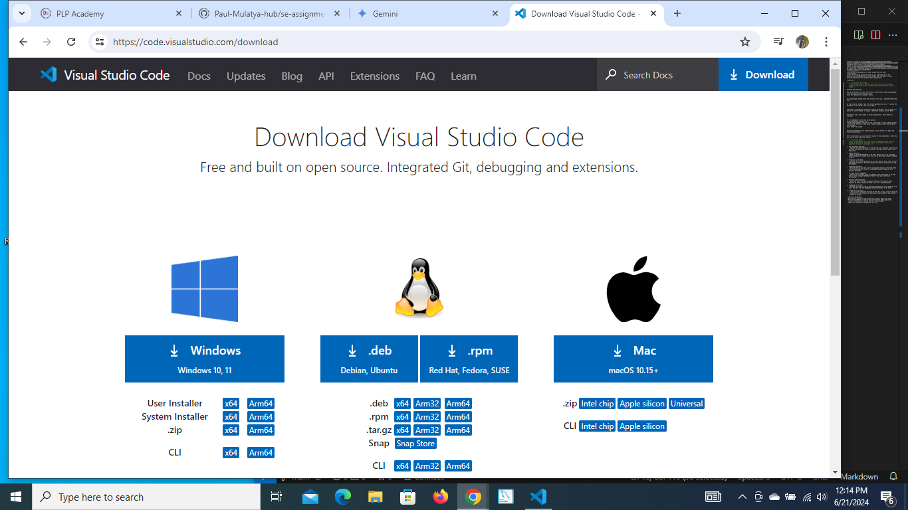

Once downloaded, double-click the installer file (e.g., VSCodeUserSetup-x64.exe).

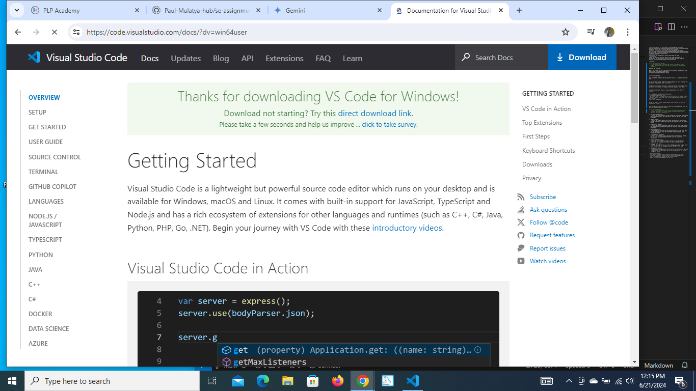

In the installer window, read the license agreement and click "I accept the agreement" if you agree. Then, click "Next".

The default installation location is usually sufficient. You can keep it as default or click "Browse" to choose a different location. Click "Next".

The default start menu folder is usually appropriate. Click "Next" to continue.

It's recommended to check all three options:
"Create a desktop shortcut icon"
"Add VS Code to PATH" (ensures you can run VS Code from any command prompt)
"Associate VS Code with .code files" (allows opening .code files directly with VS Code)
Click "Next" to proceed.

Review the summary of your chosen options. Click "Install" to begin the installation process.

After installation, you can choose to launch VS Code immediately. Check the box "Run VS Code" and click "Finish".

<!--2. First-time Setup:
   - sAfter installing VS Code, what initial configurations and settings should be adjusted for an optimal coding environment? Mention any important settings or extension.-->
Use the Settings editor to review and change VS Code settings. To open the Settings editor, navigate to File > Preferences > Settings. Alternately, open the Settings editor from the Command Palette (Ctrl+Shift+P) with Preferences: Open Settings or use the keyboard shortcut (Ctrl+,).

Changes to settings are applied directly by VS Code, as you change them. Modified settings are indicated with a blue line, similar to modified lines in the editor. eg

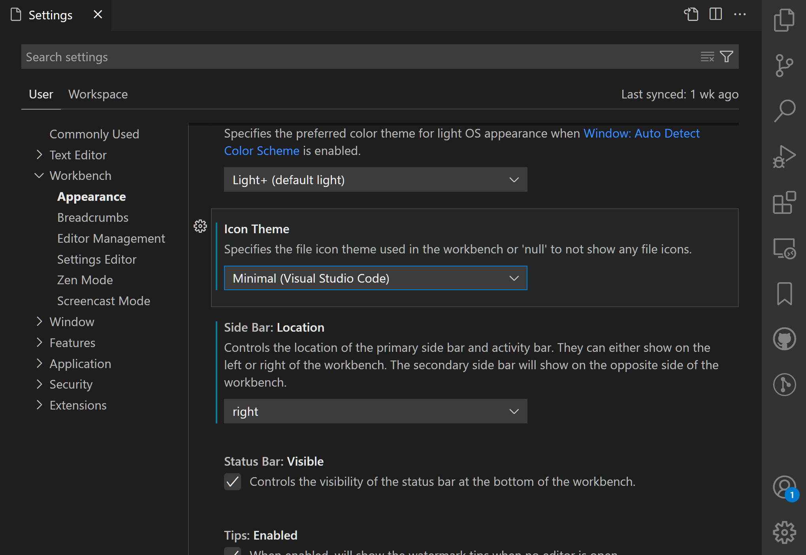

Modified settings in the Settings editor showing blue vertical bars to the left of them

The gear icon (More Actions... Shift+F9) opens a context menu with options to reset a setting to its default value, and to copy the setting ID or copy a JSON name-value pair.
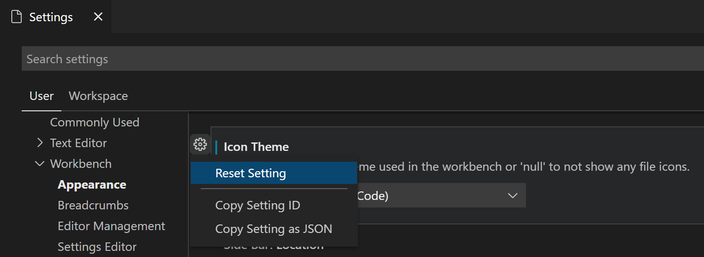

Edit settings
Each setting can be edited by either a checkbox, an text input field, or a dropdown. Edit the text or select the option you want to change to the desired settings.eg

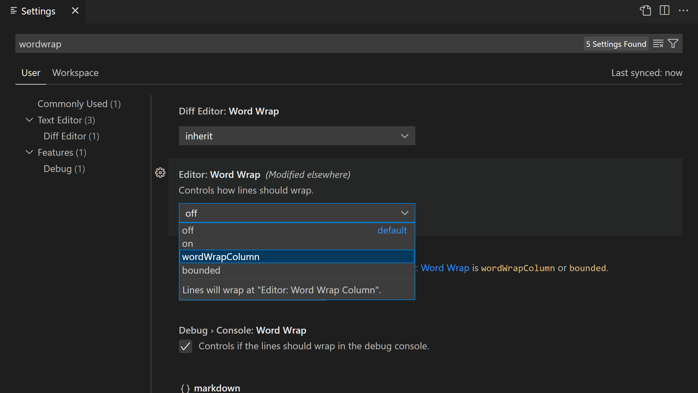

Settings are represented in groups, so that you can navigate to them easily. There is a Commonly Used group at the top, which shows popular customizations.

As an example, let's hide the Activity Bar from VS Code. You might want to hide the Activity Bar to give the editor a little more room, or if you prefer to open views via the View menu or Command Palette.

Open the Settings Editor (Ctrl+,) and type "activity" in the search bar.

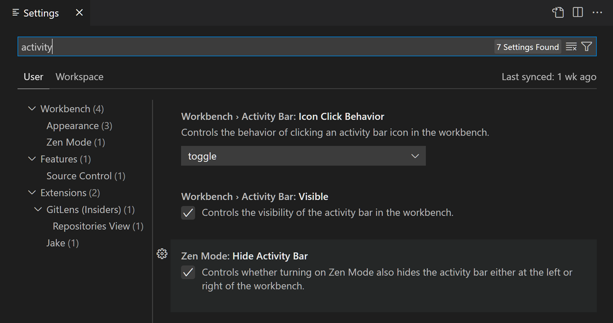
You can further limit the scope to just those settings under the Appearance group in the table of contents on the left. There should now be just three settings.

You can now check and uncheck the Workbench > Activity Bar: Visible setting to hide and unhide the Activity Bar. Notice that when you have changed the setting value to be different than the default value, you see a blue line to the left.

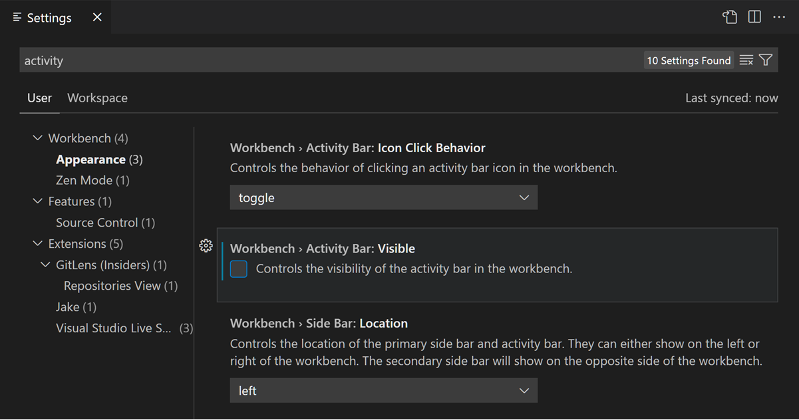

You can always reset a setting to the default value by hovering over a setting to show the gear icon, clicking on the gear icon, and then selecting the Reset Setting action.

The Settings editor search bar has several filters to make it easier to manage your settings. To the right of the search bar is a filter button with a funnel icon that provides options to easily add a filter to the search bar.

To check which settings you have configured, there is a @modified filter in the search bar. A setting shows up under this filter if its value differs from the default value, or if its value is explicitly set in the respective settings JSON file.

This filter can be useful if you have forgotten whether you configured a setting, or if the editor is not behaving as you expect because you accidentally configured a setting.

There are several other handy filters to help with searching through settings. Type the @ symbol in the search bar to discover the different filters.

<!--3. User Interface Overview:
   - Explain the main components of the VS Code user interface. Identify and describe the purpose of the Activity Bar, Side Bar, Editor Group, and Status Bar.-->
   Activity Bar (Leftmost Bar):

Provides quick access to different VS Code functionalities.
Common sections include:
Explorer: Manage your project files and folders.
Search: Search across your project files.
Source Control (Git): Interact with your Git version control system.
Debug: Tools for debugging your code.
Extensions: Manage installed extensions that add features to VS Code.
You can customize the Activity Bar to display the sections you use most frequently.

Side Bar (Right of the Activity Bar):

Offers additional context depending on the current activity.
Can house different views like:
Integrated Terminal: Run command-line tools and interact with your system.
Output Panel: View the output from various VS Code actions and tasks.
Problems Panel: See errors and warnings from your code.
The Side Bar content dynamically adapts to your current work, providing relevant information and tools.

Editor Group (Central Area):

The heart of VS Code, where you write and edit your code.
You can open multiple files or folders simultaneously, arranged in tabs.
Each tab represents an editor window where you can write and modify your code.
VS Code offers features like syntax highlighting, code completion, and debugging within the editor window.

Status Bar (Bottom Bar):

Provides contextual information about your project and editing state.
Common elements include:
Active File Path: Shows the path of the currently opened file.
Line and Column: Displays the current cursor position within the file.
Encoding: Shows the character encoding of the opened file.
Git Status: (If Git is integrated) Displays the current Git status of your project (e.g., uncommitted changes).
Language Mode: Indicates the programming language detected for the current file.
The Status Bar keeps you informed about relevant details as you work on your project.

<!--4. Command Palette:
   - What is the Command Palette in VS Code, and how can it be accessed? Provide examples of common tasks that can be performed using the Command Palette.-->

   The Command Palette in Visual Studio Code is a powerful search bar that allows you to quickly access all functionalities within VS Code, including:

Running editor commands: Format code, find and replace text, manage selections, etc.
Opening files and folders: Navigate to specific files or folders within your project.
Searching for symbols: Find functions, variables, or other defined elements in your codebase.
Viewing the command palette itself (handy if you forget the keyboard shortcut!): Search for "Command Palette".
Accessing the Command Palette:

There are two primary ways to open the Command Palette:

Keyboard Shortcut: The most common way is by pressing Ctrl+Shift+P (Windows/Linux) 
Menu Bar: Click on the "Go" menu in the menu bar and select "Command Palette".
Examples of Common Tasks with the Command Palette:

Format Document: Type "Format Document" and select the appropriate formatting option.
Find All References: Search for a symbol (function, variable) and use the "Find All References" command to locate all instances within your code.
Install Extension: Type "Install Extension" and search for the extension you want to add to VS Code.
Open Integrated Terminal: Simply search for "Terminal" to open a terminal window within VS Code.
Search for Settings: Type "Settings" to open the VS Code settings editor where you can customize various aspects of the editor.

<!--5. Extensions in VS Code:
   - Discuss the role of extensions in VS Code. How can users find, install, and manage extensions? Provide examples of essential extensions for web development.-->

Visual Studio Code extensions are like plugins that expand its functionality. They add new features, languages, themes, and tools, allowing you to customize your development experience.

Finding and installing extensions is easy. Open the Extensions view (Ctrl+Shift+X) and browse by category or search for specific features. Once you find a desired extension, click "Install" to add it to VS Code.

For web development, essential extensions include:

Language tooling: Enhance coding for specific languages like HTML, CSS, and JavaScript with features like syntax highlighting, code completion, and linting.
Debuggers: Simplify debugging web applications with breakpoints, variable inspection, and call stack exploration.
Linters and formatters: Enforce code style and catch potential errors with tools like ESLint and Prettier.
Version control: Integrate Git for version control, allowing easy collaboration and tracking code changes.
Live server extensions: Preview your web development work directly in a browser window within VS Code.

<!--6. Integrated Terminal:
   - Describe how to open and use the integrated terminal in VS Code. What are the advantages of using the integrated terminal compared to an external terminal?-->
   The integrated terminal in VS Code is a built-in command-line interface accessible within the development environment. You can open it quickly using either the Ctrl + ' (Windows/Linux) keyboard shortcut, or by navigating to the "Terminal" option in the menu bar or Command Palette (Ctrl+Shift+P).

The integrated terminal offers several advantages over using a separate terminal window:

Convenience: Seamless access to the terminal without switching between windows, keeping your code and terminal output in one place.
Integration: Interact with your project directly from the terminal. Run build commands, manage dependencies, or use Git commands without leaving VS Code.
Context awareness: The terminal can inherit the working directory of your current project, eliminating the need to navigate to the correct folder manually.
Customization: You can customize the terminal's appearance, font size, and behavior to match your preferences within VS Code settings.

<!--7. File and Folder Management:
   - Explain how to create, open, and manage files and folders in VS Code. How can users navigate between different files and directories efficiently?-->

   Creating and managing files and folders in VS Code is intuitive. Use the "File" menu or right-click options within the Explorer view (usually on the left side) to:

Create files: Select "New File" and name it appropriately.
Create folders: Choose "New Folder" and give it a relevant name.
Opening files is simply a matter of double-clicking them in the Explorer view.

VS Code offers several ways to navigate efficiently:

Explorer view: Browse your project structure visually.
Quick Open (Ctrl+P): Search for specific files by name to open them instantly.
Go to File (Ctrl+G): Jump to any file path within your project by entering its relative location.
File Switcher (Ctrl+Tab): Quickly switch between recently opened files using keyboard shortcuts

<!--8. Settings and Preferences:
   - Where can users find and customize settings in VS Code? Provide examples of how to change the theme, font size, and keybindings.-->
Use the Settings editor to review and change VS Code settings. To open the Settings editor, navigate to File > Preferences > Settings.When you open the Settings editor, you can search and discover the settings you are looking for. When you search using the search bar, it not only shows and highlights the settings matching your criteria, but also filter out those which are not matching. This makes finding settings quick and easy

Theme: Search for "Theme" in the settings and choose from a pre-installed selection or install themes from the extensions marketplace.
Font Size: Look for "Font Size" and adjust the slider or enter a specific pixel value to change the overall font size in the editor.
Search for "Keyboard Shortcuts" to view the default keybindings. You can search for specific commands or browse by category.
Click on a keybinding next to a command to modify it. Press your desired key combination to reassign it.

<!--9. Debugging in VS Code:
   - Outline the steps to set up and start debugging a simple program in VS Code. What are some key debugging features available in VS Code?-->

   One of the key features of Visual Studio Code is its great debugging support. VS Code's built-in debugger helps accelerate your edit, compile, and debug loop.
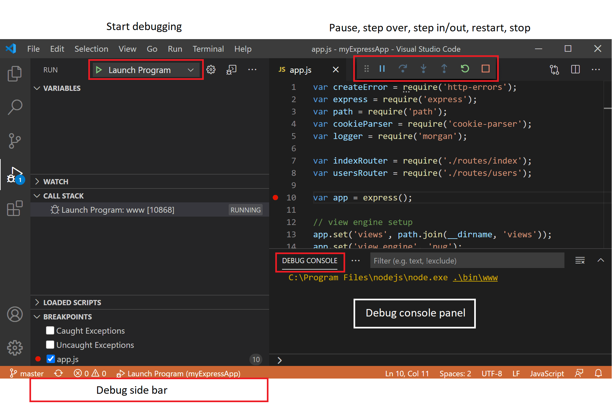

To bring up the Run and Debug view, select the Run and Debug icon in the Activity Bar on the side of VS Code. You can also use the keyboard shortcut Ctrl+Shift+D.

If running and debugging is not yet configured (no launch.json has been created), VS Code shows the Run start view.

The top-level Run menu has the most common run and debug commands:
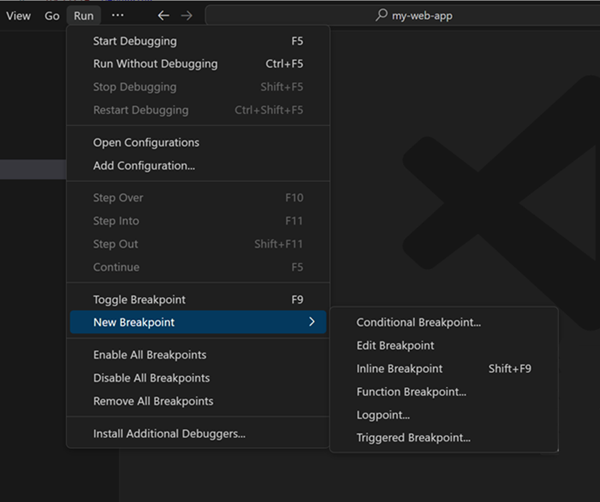

<!--10. Using Source Control:
    - How can users integrate Git with VS Code for version control? Describe the process of initializing a repository, making commits, and pushing changes to GitHub.-->

   Open the VS code, then open a new terminal and create a new empty folder using this command: mkdir gfg

then go to this folder (cd gfg) and open this folder.
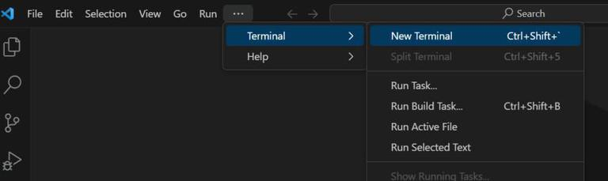

create folder

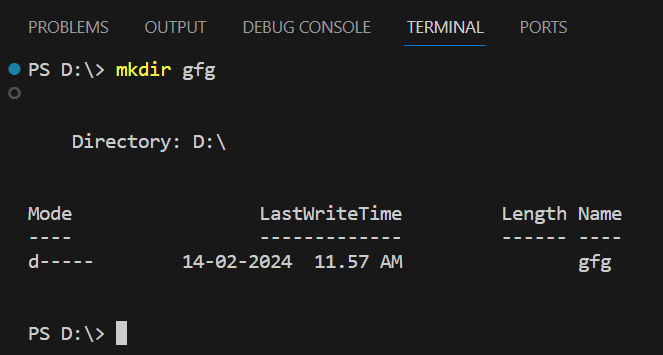

open folder

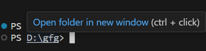

Step 2: Then open our folder new terminal and create new react project using this command : npx create-react-app gfgreact.

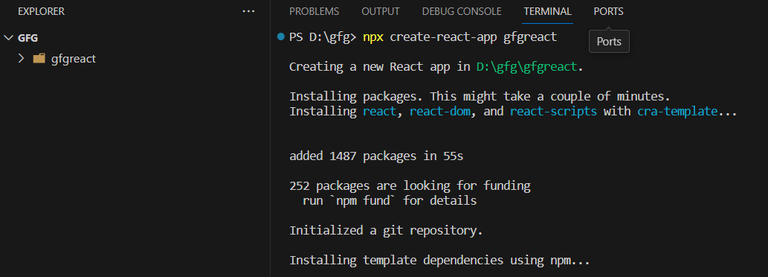

Step 3: Then initialize with git repository using this command: git init .

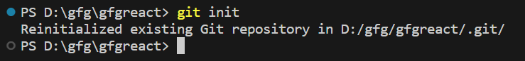

Then add all changes in git using this command : git add . and check the status using this command: git status

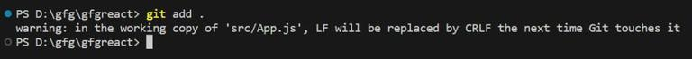

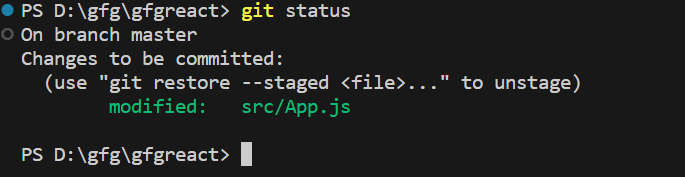

Then commit all changes using this command : git commit -m “change the app.js file” and check the status using this command: git status

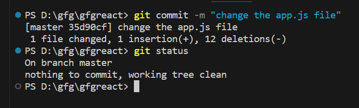

Go to the GitHub

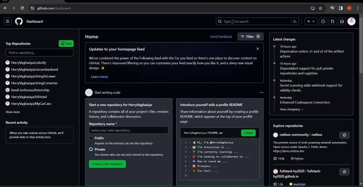

then click your profile

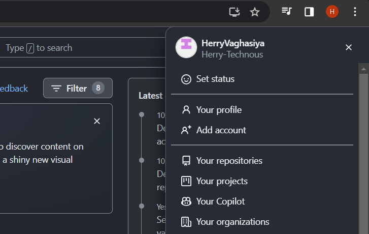

select your repositories folder

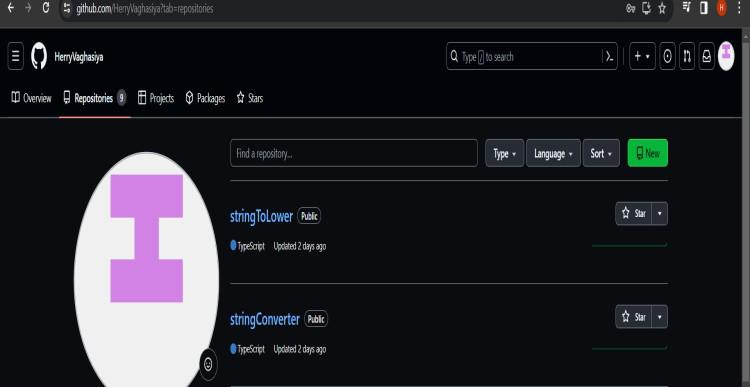

 Then click on new button and create new repository and give the name  and check that our repository is created successfully or not then copy the repository link.

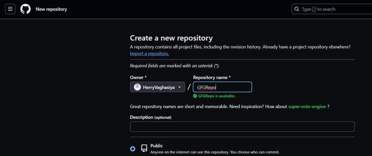
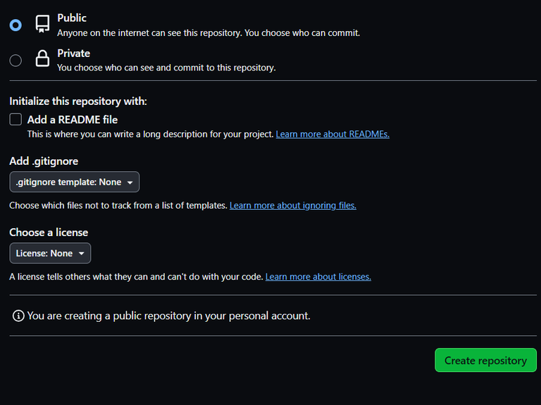

Then go to vs code terminal and get the remote of our git repository using this command : git remote add origin https://github.com/HerryVaghasiya/GFGRepo.git(copy into the above).

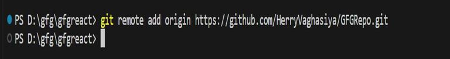

check that repository remote is success fully added or not using this command : git remote -v
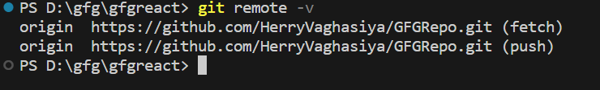

check our git repository branch using this command: git branch
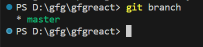

change our branch name master to main because GitHub change its default branch name master to main so rename our branch name using this command: git branch -M main

check branch name : git branch

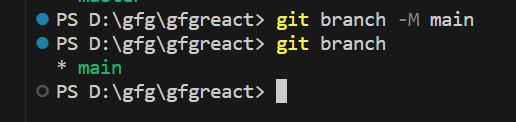

Then push our code in GitHub repository using this command: git push -u origin main

(Note : -u means set upstream. If you want to work on the same project for a long time, there is a shortcut key that will set the branch name as default so that you don’t have to give the same branch name every time. )

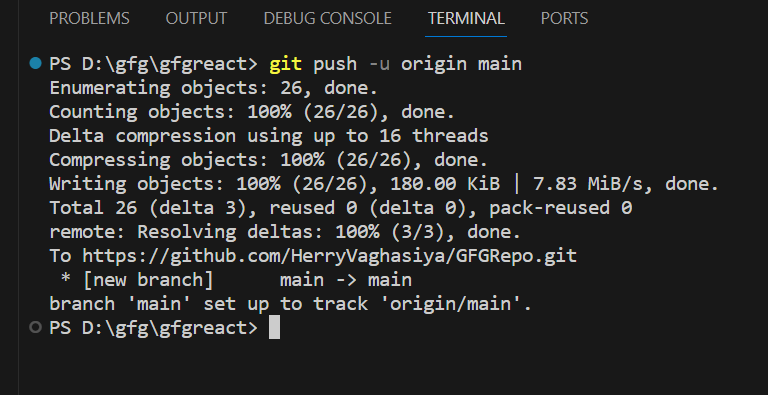

 Submission Guidelines:
- Your answers should be well-structured, concise, and to the point.
- Provide screenshots or step-by-step instructions where applicable.
- Cite any references or sources you use in your answers.
- Submit your completed assignment by 1st July 

